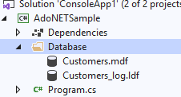
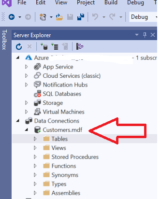
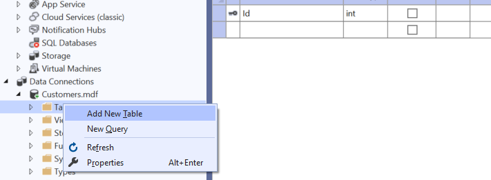
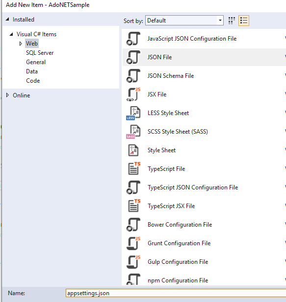
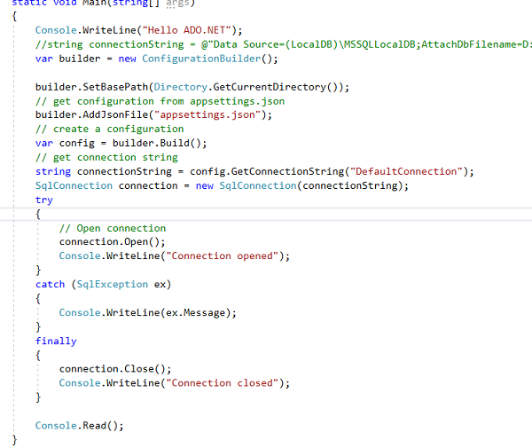

# ADO.NET and EF Core

## Purpose
The purpose of the task: to get a practical experience on how to work with ADO.NET to connect and store the applicatin data in the MS SQL local database.You will learn:
- how to create a sample database using Visual Studio 2019;
- how to expolore and update properties of the database by using VS Server Explorer;
- how to store the connection string in the appsetting.json configuration file;
- how to read, update and delete data from the database tables using ADO.NET classes.

Estimated time to complete: 3 hours.   

Task status: mandatory / Manually-checked.   

## Description
1. Clone a skeleton solution from the repository provided by AutoCode
1. Create a new project and add to the solution. Use the `Console App (.NET Core)` VS 2019 project type
1. Create `Folder Database`
1. Select folder in `Solution` explorer and Add Database `Customers`:  
    
     

1. You should get
   
       

1. Open `VS Server Explorer` and see your database in the server view
  
    

1. Add `Customers` Table to the `Customers.mdf` database

    

1. Rename the default name `Table` to `Customers` by running script

    

1. Refresh the Server Explorer View and make sure you got the database table renamed

    

1. Select `Customers.mdf` in Server Explorer view, open `Properties` window and copy a connection string to the database

    

1. Add a local variable to the `Main` method to store the connection string (see sample below)
1. Add a code to open the database connection using ADO.NET  and close the connection

    

1. Run the application and make sure it works
1. Add `appsettings.json` and configure it

    

1. Configure `appsettings.json` (Copy if newer)

    

1. Move connection string value to the `appsettings.json`

    

1. Change code in Main, so you read your connection settings from the appsettings.json file

    

1. Run the application and make sure it works. Now you read the path to the database from the connection string. 

1. Add code for :
    a.	Adding records to the database
    b.	Deleting a record by the customer name
    c.	Updating a record by the customer name

